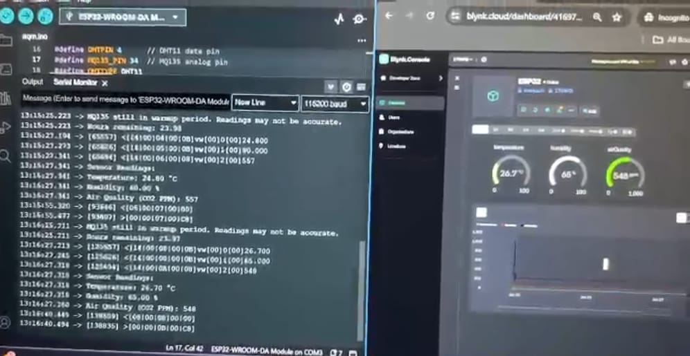

# Remote Air Quality Monitoring IoT

This IoT project monitors air quality, temperature, and humidity in real-time, sending data to the **Blynk app**. It uses an **ESP32** microcontroller, a **DHT11** sensor for temperature and humidity, and an **MQ135** sensor for air quality (CO2 levels). The system also sends alerts when parameters exceed defined thresholds. The MQ135 sensor requires 24-hour warm up period for accurate CO2 readings.

## Features
- Monitors **temperature**, **humidity**, and **air quality (CO2 levels)**.
- Sends data to the **Blynk app** for real-time monitoring.
- Alerts when:
  - **Temperature** > 100°C
  - **Humidity** > 85%
  - **Air Quality (CO2)** > 1000 PPM
- Uses **MQ135** for air quality (requires calibration) and **DHT11** for temperature and humidity.
- Supports **ESP32** and WiFi.

## Hardware Setup

### DHT11 (Temperature & Humidity)
- **VCC** to 3.3V
- **GND** to GND
- **Data Pin** to **GPIO 4**

### MQ135 (Air Quality)
- **VCC** to 5V
- **GND** to GND
- **Analog Output (AOUT)** to **GPIO 34**

### ESP32
- Use an **ESP32 DevKit** or compatible board.

## Software Setup

1. **Install Libraries**:
   - Install **Blynk**, **DHT**, and **MQ135** libraries via Arduino IDE.

2. **Create Blynk Project**:
   - Create a new project in the **Blynk app** for **ESP32**.
   - Add **Value Display** widgets for temperature (V0), humidity (V1), and air quality (V2).
   - Get the **auth token** from Blynk and add it to the code.

3. **Upload Code**:
   - Replace **WiFi credentials** and **Blynk AUTH Token** in the code.
   - Open the _Arduino IDE_ and select the correct **ESP32 board and COM port**.
   - Upload the code to ESP32.

### Calibration
<!--The **MQ135** sensor requires calibration for accurate air quality readings. The following parameters are used in the code for calibration:
- **RZERO**: Calibration resistance at atmospheric CO2 levels.
- **RLOAD**: Load resistance in kΩ.
- **PARA** and **PARB**: Linearizing parameters for accurate CO2 readings.
-->
After setting up the system, ensure the MQ135 sensor is given at least **24 hours** to warm up for reliable readings. During this period, the code checks whether the sensor is still in the warm-up stage and displays a message in the Serial Monitor.

### Alerts Thresholds
- **Temperature** > 100°C
- **Humidity** > 85%
- **Air Quality (CO2)** > 1000 PPM
The alerts will display notifications on the Blynk app, notifying the user of any critical environmental changes.

### Timers
A Blynk timer is used to send sensor data to the Blynk app every 60 seconds  `(timer.setInterval(60000L, sendSensorData);`).

### Example Output (Serial Monitor)
When the system is running, the serial monitor will display the following information:
```yaml
Sensor Readings:
Temperature: 25.3 °C
Humidity: 55.6 %
Air Quality: 300
Corrected CO2 PPM: 400.56
```



## Troubleshooting

- **DHT11 issues**: Ensure correct wiring and if readings are consistently NaN, reset the DHT sensor in the code using `dht.begin();`.
- **MQ135 calibration**: Wait for the **24-hour warm-up** period and ensure proper calibration and that it's not exposed to any significant air contaminants for accurate CO2 PPM readings.
- **Blynk app**: Check WiFi and **auth token** if no data is received.

## License
This project is open-source under [LICENSE](License). Modify and use it as needed.
